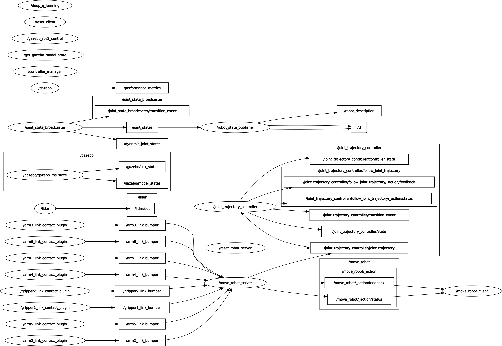

# ReinforceArm 

## Aprendizado por reforço aplicado a braço robótico em ambiente de simulação ROS

> Este projeto de TCC implementa dois algoritmos de aprendizado por reforço (Q-Learning e Deep Q-Learning) para controlar um braço robótico simulado no ambiente Gazebo com ROS 2. O objetivo é treinar o robô a realizar a tarefa de tocar o end-effector em um bloco fixo no solo. A simulação permite testar estratégias de controle inteligentes antes da implementação em robôs físicos.

## 🚀 Instalando ReinforceArm

⟳ Em construção

## ☕ Usando ReinforceArm

⟳ Em construção